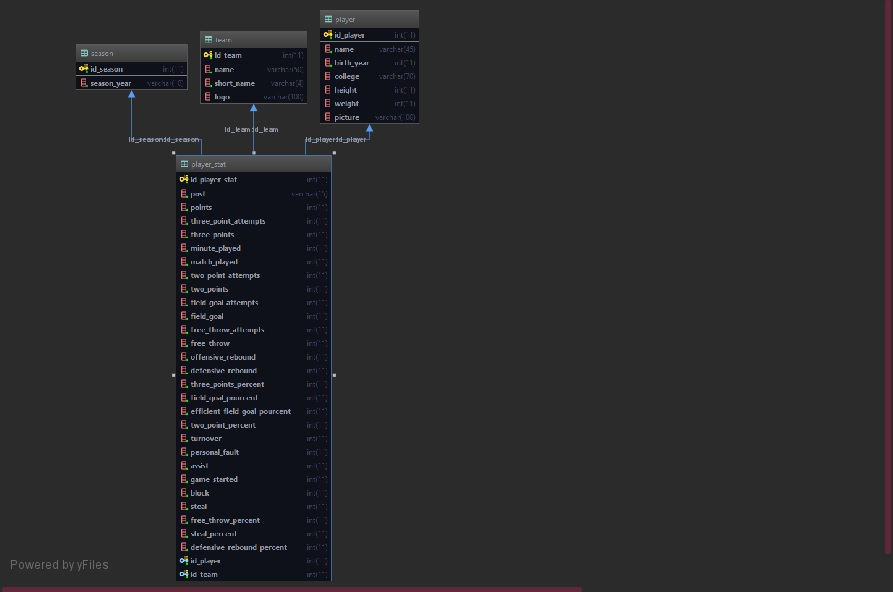

# Nba DataViz PlayerZ

### Groupe 7 :

* Nino Lamoureux
* Antoine Beaudoire
* Clément Haller 
* Mickael De Jesus
* Alice Fabre 

## Modélisation de la base de données

#### Sources de nos données brutes 

Pour créer notre projet nous avons sélectionné 2 bases de données : 

https://www.basketball-reference.com/players/

Pour récupérer les photos des joueurs :

https://stats.nba.com/players/

Choix techniques de développement 

### Les technologies que nous avons choisis d’utiliser pour notre projet sont : 

#### React : 
les développeurs étaient déjà familier avec React et souhaitaient approfondir  leurs connaissances et pratique de ce framework.
la communauté qui gravite autour de React est importante. En cas de besoin, une aide sera bien plus facile à trouver, mais aussi plus de librairies compatibles et de conseils dans le développement.
React facilite la création d’interface utilisateur et permet surtout de créer des interfaces et des composants réutilisables, avec des données qui peuvent changer en cours de route 
React crée son propre DOM virtuel où sont rattachés les composants. Cette approche donne énormément de flexibilité et des performances exceptionnelles, car React calcule quel changement dans le DOM a besoin d’être fait, et change juste la partie qui a besoin d’être mise à jour. 

#### Chart React : 
###### dépendance permettant d’utiliser la librairie graphique Chart Js dans React

Chart Js (librairie de graphiques) et React svg donut (https://www.npmjs.com/package/react-svg-donut) : 
les graphiques sont interactifs, se mettent à jour en temps réel, et sont personnalisables. Ils se crée à partir de la données.
aucun plugin supplémentaire nécessaire
bonne documentation et facile à utiliser

#### Node.js : 
programmation asynchrone et non bloquant (le thread ne reste pas bloqué à attendre la fin de l'opération, il continue le code qui suit).
outil performant et rapide
rassemble une grande communauté de développeurs qui contribuent et aident 

##### Express (framework de Node.js pour la gestion des routes)

#### Fetch API (méthode pour récupérer les données) 

